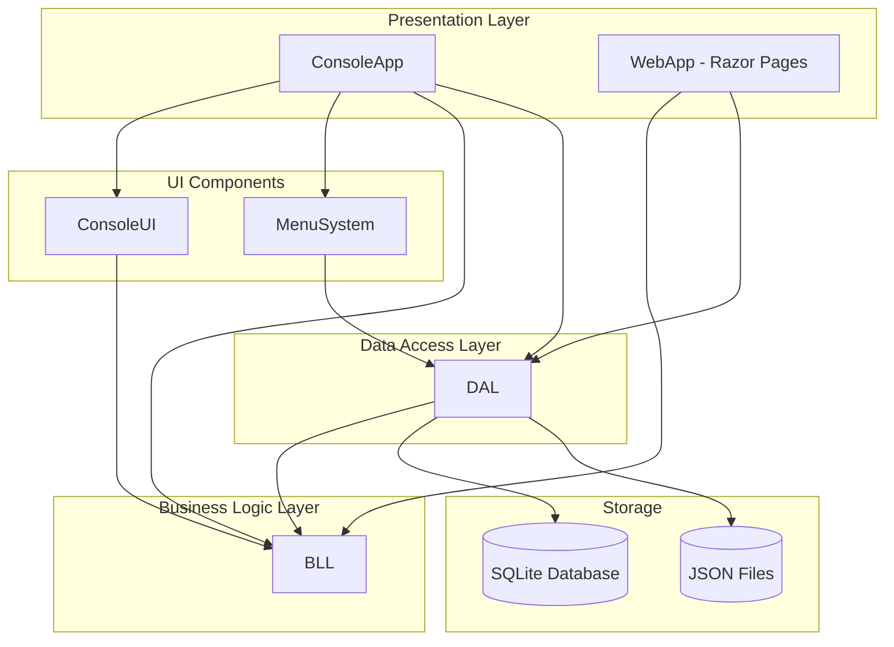
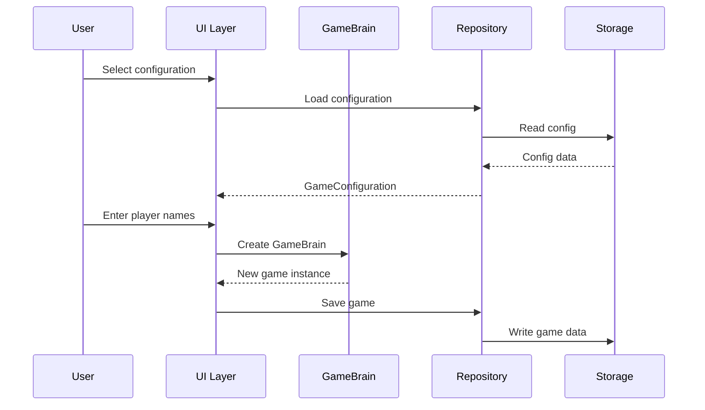
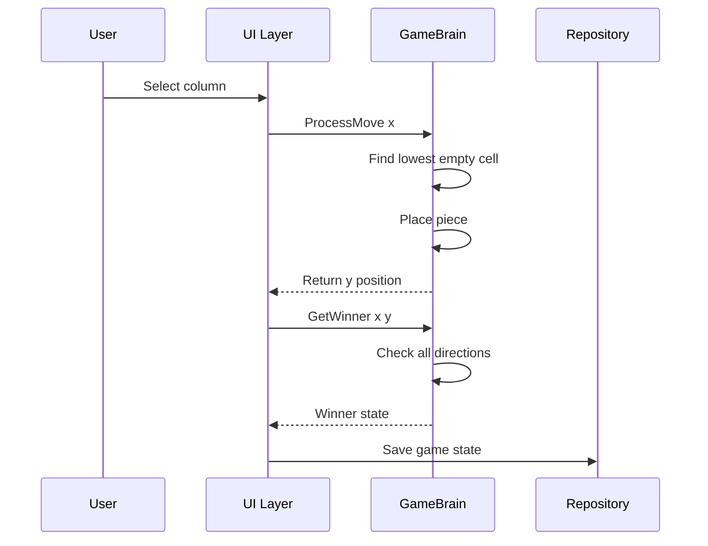

# ConnectX - Architecture Documentation

## System Architecture Overview

ConnectX follows a clean multi-layer architecture with clear separation of concerns. The solution consists of 6 projects organized into distinct layers.

## Project Structure

### BLL - Business Logic Layer
**Path:** `/BLL/`

Core game logic and domain models:

| File | Purpose |
|------|---------|
| [`BaseEntity.cs`](BLL/BaseEntity.cs) | Abstract base class with GUID Id property |
| [`GameBrain.cs`](BLL/GameBrain.cs:1) | Main game engine - board state, move processing, win detection |
| [`GameConfiguration.cs`](BLL/GameConfiguration.cs:1) | Game settings - board size, win condition, cylindrical mode |
| [`GameData.cs`](BLL/GameData.cs:1) | DTO for serializing/deserializing game state |
| [`ECellState.cs`](BLL/ECellState.cs:1) | Enum: Empty, Red, Blue, RedWin, BlueWin |
| [`EPlayerType.cs`](BLL/EPlayerType.cs:1) | Enum: Human, Ai |

### DAL - Data Access Layer
**Path:** `/DAL/`

Repository pattern implementation with dual storage support:

| File | Purpose |
|------|---------|
| [`IRepository.cs`](DAL/IRepository.cs:1) | Generic repository interface - List, Save, Load, Delete |
| [`GameRepositoryEf.cs`](DAL/GameRepositoryEf.cs:1) | EF Core implementation for game persistence |
| [`GameRepositoryJson.cs`](DAL/GameRepositoryJson.cs:1) | JSON file implementation for game persistence |
| [`ConfigRepositoryEf.cs`](DAL/ConfigRepositoryEf.cs:1) | EF Core implementation for configuration persistence |
| [`ConfigRepositoryJson.cs`](DAL/ConfigRepositoryJson.cs:1) | JSON file implementation for configuration persistence |
| [`AppDbContext.cs`](DAL/AppDbContext.cs:1) | EF Core DbContext with custom converters |
| [`GameEntities.cs`](DAL/GameEntities.cs:1) | Database entities: Configuration, Game |
| [`FilesystemHelpers.cs`](DAL/FilesystemHelpers.cs:1) | Helper for file storage paths |

### ConsoleApp
**Path:** `/ConsoleApp/`

Console application entry point and orchestration:

| File | Purpose |
|------|---------|
| [`Program.cs`](ConsoleApp/Program.cs:1) | Entry point - storage method selection, DI setup |
| [`GameController.cs`](ConsoleApp/GameController.cs:1) | Game loop controller for console gameplay |
| [`MenuFactory.cs`](ConsoleApp/MenuFactory.cs:1) | Menu structure creation and action handlers |
| [`AppDbContextFactory.cs`](ConsoleApp/AppDbContextFactory.cs:1) | Design-time DbContext factory for migrations |

### ConsoleUI
**Path:** `/ConsoleUI/`

Console rendering utilities:

| File | Purpose |
|------|---------|
| [`Ui.cs`](ConsoleUI/Ui.cs:1) | Board rendering with colored output, cylindrical board display |

### MenuSystem
**Path:** `/MenuSystem/`

Reusable console menu navigation:

| File | Purpose |
|------|---------|
| [`Menu.cs`](MenuSystem/Menu.cs:1) | Menu display and navigation logic |
| [`MenuItem.cs`](MenuSystem/MenuItem.cs:1) | Individual menu item with action delegate |
| [`EMenuLevel.cs`](MenuSystem/EMenuLevel.cs:1) | Enum: Root, Second, Deep - controls navigation options |

### WebApp
**Path:** `/WebApp/`

ASP.NET Core Razor Pages web application:

| File | Purpose |
|------|---------|
| [`Program.cs`](WebApp/Program.cs:1) | Web app configuration, DI setup |
| [`Pages/Index.cshtml`](WebApp/Pages/Index.cshtml:1) | Home page - lists configs and games |
| [`Pages/NewGame.cshtml`](WebApp/Pages/NewGame.cshtml:1) | New game form |
| [`Pages/GamePlay.cshtml`](WebApp/Pages/GamePlay.cshtml:1) | Interactive game board |
| [`Pages/SavedGames.cshtml`](WebApp/Pages/SavedGames.cshtml:1) | Saved games list |
| [`Pages/Configurations.cshtml`](WebApp/Pages/Configurations.cshtml:1) | Configuration management |
| [`Pages/EditConfiguration.cshtml`](WebApp/Pages/EditConfiguration.cshtml:1) | Create/edit configuration form |
| [`Pages/DeleteGame.cshtml`](WebApp/Pages/DeleteGame.cshtml:1) | Delete game confirmation |
| [`Pages/DeleteConfiguration.cshtml`](WebApp/Pages/DeleteConfiguration.cshtml:1) | Delete configuration confirmation |

## Design Patterns

### Repository Pattern
The [`IRepository<TData>`](DAL/IRepository.cs:3) interface abstracts data access:
- `List()` / `ListAsync()` - Get all items
- `Save(TData)` - Create or update
- `Load(Guid)` - Retrieve by ID
- `Delete(Guid)` - Remove by ID

Two implementations per entity type:
- EF Core repositories for SQLite database
- JSON repositories for file-based storage

### Data Transfer Object (DTO)
[`GameData`](BLL/GameData.cs:5) serves as a DTO for serializing game state:
- Converts between 2D array and jagged array for JSON compatibility
- Contains all state needed to reconstruct a [`GameBrain`](BLL/GameBrain.cs:3)

### Dependency Injection
Both applications use DI for repository injection:
- Console: Manual instantiation based on user choice
- Web: ASP.NET Core built-in DI container

## Data Flow

### Game Creation Flow

### Move Processing Flow

## Storage Locations

### JSON File Storage
- Configurations: `~/ConnectX/configs/`
- Saved Games: `~/ConnectX/savegames/`

### SQLite Database
- Database file: `~/ConnectX/database/app.db`

## Key Technical Decisions

1. **Dual Storage Support**: Allows flexibility between lightweight JSON files and structured SQLite database
2. **Shared BLL**: Both Console and Web apps use identical business logic
3. **Repository Abstraction**: Easy to swap storage implementations
4. **Jagged Array Serialization**: 2D arrays converted to jagged arrays for JSON/EF compatibility
5. **GUID-based IDs**: All entities use GUIDs for unique identification
6. **Nullable Enabled**: Project uses C# nullable reference types for safety