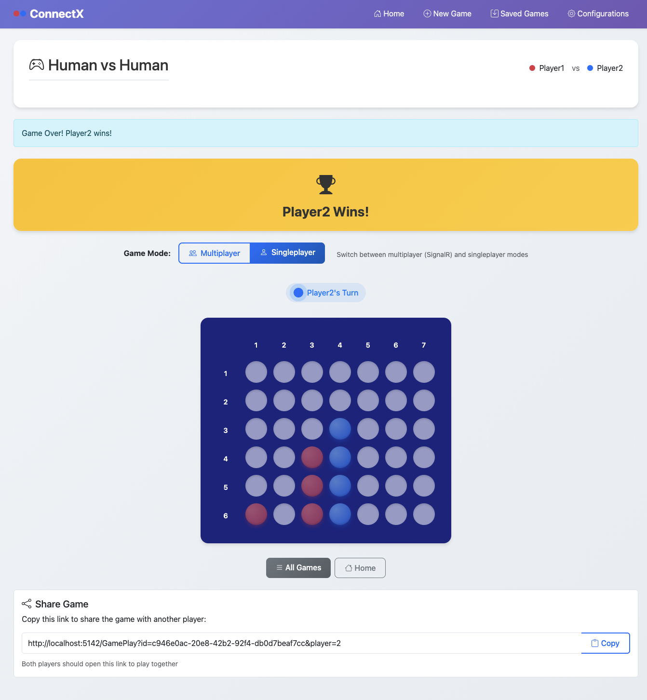

# ConnectX (C# / .NET 9, ASP.NET Core Razor Pages, EF Core + SQLite)

## Description

ConnectX is a customizable Connect Four implementation with two frontends:
- a console application
- a web application (Razor Pages)

The game supports configurable board sizes, win conditions, and an optional cylindrical (wrap-around) mode. The WebApp also includes a real-time multiplayer mode implemented with SignalR/WebSockets (see [`GameHub`](WebApp/Hubs/GameHub.cs:1)). Games and configurations can be persisted either to SQLite (via EF Core) or to JSON files.

### Web application homepage


### Web application gameplay page after winning



## Requirements

- .NET SDK 9.0
- (Optional) Rider / Visual Studio / VS Code with C# extension

## Solution Structure

ConnectX follows a clean multi-layer architecture with clear separation of concerns.

Key projects and entry points:
- Business logic: [`GameBrain`](BLL/GameBrain.cs:1), configuration: [`GameConfiguration`](BLL/GameConfiguration.cs:1)
- Data access: repository abstraction [`IRepository<TData>`](DAL/IRepository.cs:1), EF Core context [`AppDbContext`](DAL/AppDbContext.cs:1)
- Console app entry point: [`Program`](ConsoleApp/Program.cs:1)
- Web app entry point: [`Program`](WebApp/Program.cs:1)

## Running the Application

### Console application

1. From repository root, run:
   ```bash
   cd ConsoleApp
   dotnet run
   ```
2. On startup, choose storage method:
   - Press `j` for JSON file storage
   - Press any other key for EF Core / SQLite storage

### Web application (Razor Pages)

1. From repository root, run:
   ```bash
   cd WebApp
   dotnet run
   ```
2. Open in a browser:
   - `https://localhost:5001` or
   - `http://localhost:5000`

## Storage Locations

All paths are relative to the user home directory (`~`).

### JSON file storage

- Configurations: `~/ConnectX/configs/`
- Saved games: `~/ConnectX/savegames/`

JSON storage helpers: [`FilesystemHelpers`](DAL/FilesystemHelpers.cs:1) and JSON repositories [`GameRepositoryJson`](DAL/GameRepositoryJson.cs:1), [`ConfigRepositoryJson`](DAL/ConfigRepositoryJson.cs:1).

### SQLite database (EF Core)

- Database file: `~/ConnectX/database/app.db`

EF Core context: [`AppDbContext`](DAL/AppDbContext.cs:1). EF Core repositories [`GameRepositoryEf`](DAL/GameRepositoryEf.cs:1), [`ConfigRepositoryEf`](DAL/ConfigRepositoryEf.cs:1). Migrations are in [`DAL/Migrations`](DAL/Migrations/).

## Design Choices

- **Shared business logic**: both UIs use the same core engine ([`GameBrain`](BLL/GameBrain.cs:1)) to avoid duplicated rules and win-detection logic.
- **Repository abstraction**: persistence is behind [`IRepository<TData>`](DAL/IRepository.cs:1), allowing storage to be swapped without changing UI code.
- **Strict null-safety**: nullable reference types are enabled and key warnings are treated as errors via [`Directory.Build.props`](Directory.Build.props:1).

## Technical Highlights

- **Kilo Code usage**: this project is developed with Kilo Code assistance.
- **SignalR + WebSockets (real-time multiplayer)**: WebApp multiplayer is implemented via SignalR hub [`GameHub`](WebApp/Hubs/GameHub.cs:1).
- **Repository + interface pattern (dual storage)**: persistence is behind [`IRepository<TData>`](DAL/IRepository.cs:1) with two implementations per entity type:
  - EF Core repositories (SQLite): e.g. [`GameRepositoryEf`](DAL/GameRepositoryEf.cs:1), [`ConfigRepositoryEf`](DAL/ConfigRepositoryEf.cs:1)
  - JSON repositories (filesystem): e.g. [`GameRepositoryJson`](DAL/GameRepositoryJson.cs:1), [`ConfigRepositoryJson`](DAL/ConfigRepositoryJson.cs:1)
- **DTO usage for persistence**: [`GameData`](BLL/GameData.cs:1) serializes/deserializes game state and converts between 2D arrays and jagged arrays for JSON/EF compatibility.
- **Layering / clean architecture**: BLL contains rules and state, DAL contains persistence, and UIs focus on interaction and rendering.
- **Bootstrap UI (WebApp)**: Web UI is built with Bootstrap.
